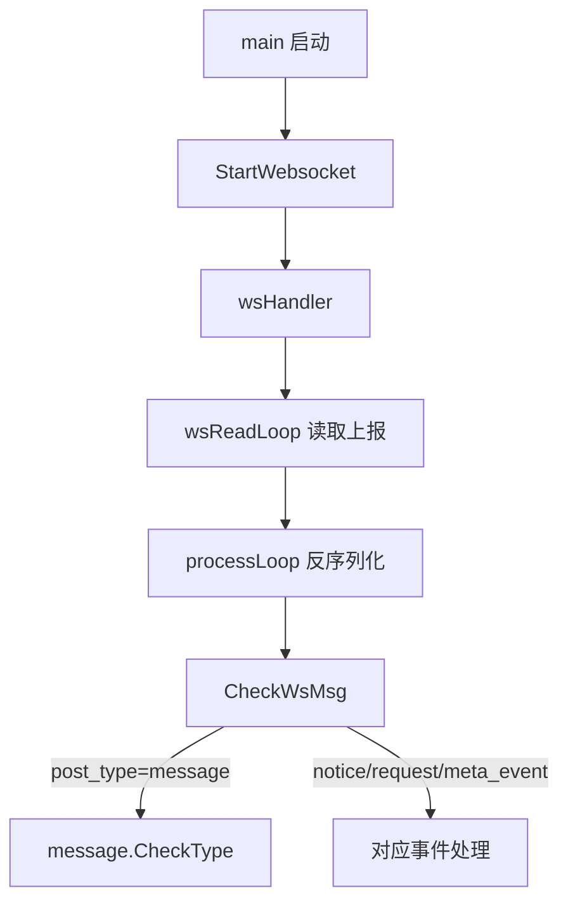

# 聊天机器人现状、实现方案与流程梳理

## 1. 文档目的

- 对当前机器人项目的整体状态做一次可交接的梳理。
- 明确“消息如何进来、如何分发、如何处理、如何回发”的完整链路。
- 总结已实现能力、关键依赖、外部接口与当前风险点，便于后续迭代。

## 2. 当前现状（What）

### 2.1 技术与工程形态

- 语言与框架：Go 单体服务。
- 输入通道：WebSocket（接收 OneBot/NapCat 上报）。
- 输出通道：HTTP 调用 NapCat API 发送私聊/群聊消息。
- 模块形态：按事件与功能分包，核心目录为 `controll/`、`event/`、`function/`、`send/`、`model/`。
- 文档现状：已有 `doc/` 命令文档，缺少一份“系统级架构+流程”说明（本文件补齐）。

### 2.2 已实现核心能力

- 消息事件分发：支持 `message`、`notice`、`request`、`meta_event`。
- 群聊处理能力：
  - `#` 前缀修仙系统（创建角色、修炼、突破、商店等）。
  - `@机器人` 触发预设回复或 ChatGPT。
  - 关键词命令分发（天气、点歌、涩图、签到、ban、车站查询等）。
  - 兜底能力（表情包 `.jpg` 合成、车牌检测、复读检测）。
- 私聊能力：默认进入 ChatGPT 问答链路。
- HTTP 扩展接口：支持 `justChat`、发私信、战绩上报相关接口。
- 定时任务：支持 cron 定时推送（如签到等自动任务）。

### 2.3 当前约束与风险

- ChatGPT 调用采用单协程串行队列（并发容量为 1），高峰期可能堆积。
- 业务逻辑偏集中在关键词分发与 `group` 主流程，扩展时耦合度逐步升高。
- 外部 API 依赖较多（天气、音乐、战绩、OpenAI 等），缺少统一降级策略说明。
- 配置依赖本地配置文件，环境区分与配置治理能力有提升空间。

## 3. 实现方案（How）

### 3.1 总体架构

```text
OneBot/NapCat 上报
        │ (WebSocket)
        ▼
controll/ws.go: wsReadLoop/processLoop
        ▼
controll/receive.go: CheckWsMsg(post_type分发)
        ▼
event/message|notice|request|metaEvent
        ▼
function/* 业务模块（chatGPT、immortal、music、wether...）
        ▼
send/send.go（封装 NapCat HTTP API）
        ▼
QQ 私聊/群聊回发
```

### 3.2 模块职责划分

- `main.go`
  - 启动 WebSocket 接收。
  - 挂载 HTTP 路由与静态目录。
- `controll/`
  - `ws.go`：WebSocket 连接管理、读循环、事件进入总线。
  - `receive.go`：按 `post_type` 做一级分发。
  - `http.go`：提供外部可调用 HTTP 能力。
- `event/`
  - `message/`：消息事件核心入口与分发。
  - `request/notice/metaEvent/`：其他事件处理。
- `function/`
  - 业务实现层，按能力拆分（ChatGPT、修仙、天气、音乐、图片、复读等）。
- `send/`
  - 统一发送出口，屏蔽上游 API 细节。
- `model/`
  - 数据访问层（MySQL/GORM/Redis 等）。
- `interval/`
  - 定时任务注册与执行。

### 3.3 数据与依赖

- 数据存储：
  - MySQL（主业务数据）。
  - Redis（修仙等子系统缓存/状态）。
- 关键库：
  - WebSocket、GORM、sqlx、cron、OpenAI SDK、二维码与图像处理库。
- 外部依赖：
  - NapCat/OneBot API。
  - Chat/绘图 API。
  - 天气、音乐、300 战绩、车站等第三方接口。

## 4. 核心流程（Flow）

### 4.1 接收与分发主流程



### 4.2 消息处理细化（group）

```mermaid
flowchart TD
    A[group(msg)] --> B[ban/群开关/子类型过滤]
    B --> C{是否以#开头}
    C -->|是| D[immortal.CheckKeywords]
    C -->|否| E{是否@机器人}
    E -->|是| F[checkAtWords: 预设回复或ChatGPT]
    E -->|否| G{是否包含机器人名}
    G -->|是| H[chatGPT.AddPlan]
    G -->|否| I[checkKeywords 首词命令]
    I --> J[命令命中则执行业务]
    J --> K[send 统一回发]
    I --> L[未命中: .jpg/车牌/复读兜底]
    L --> K[send 统一回发]
```

### 4.3 ChatGPT 处理流程

```text
群聊/私聊触发
  -> AddPlan/AddPlanPrivate 入队
  -> AskForChatGPT 调用模型
  -> send.SendGroupPost/SendPrivatePost 回发
```

## 5. 现有能力清单（按场景）

- 会话类：群聊问答、私聊问答、@触发问答、关键词预设回复。
- 娱乐类：涩图、音乐查询、表情包文字合成、复读互动。
- 游戏/数据类：300 战绩相关、BangDream 车站信息。
- 养成类：修仙系统全套命令。
- 管理类：签到、ban 管理、精华消息等。
- 运维类：HTTP 扩展接口、定时任务。

## 6. 迭代建议（Next）

- 稳定性：
  - 为外部 API 调用补齐统一超时、重试、熔断与降级文案。
  - 为 ChatGPT 请求增加队列长度监控与超时告警。
- 架构：
  - 将 `group` 与关键词分发中的高耦合逻辑下沉为可插拔 Handler。
  - 统一命令注册机制（替代长 `switch`），提高可维护性。
- 可观测性：
  - 增加关键链路日志字段（事件ID、群ID、耗时、外部调用状态）。
  - 增加核心指标（QPS、失败率、队列堆积、第三方接口错误率）。
- 工程化：
  - 区分 dev/test/prod 配置模板，完善配置项说明。
  - 为关键流程补充最小可运行测试样例（消息分发、命令路由、发送回发）。

## 7. 一句话总结

- 当前机器人已经形成“事件驱动 + 模块化业务 + 统一发送出口”的可运行架构，功能覆盖较全；下一阶段建议优先补齐稳定性与可维护性能力。

